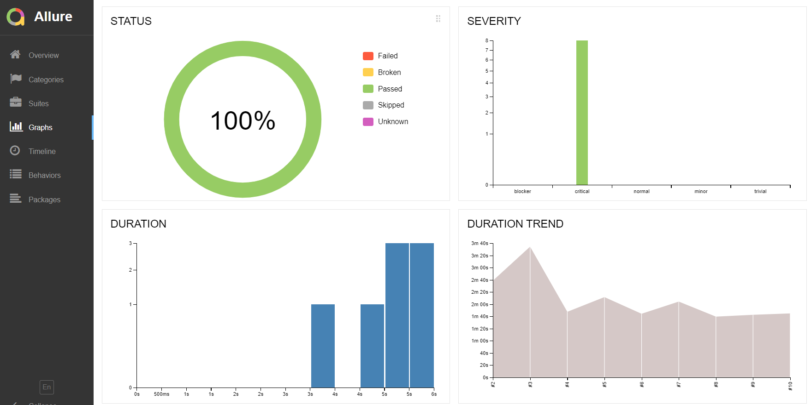
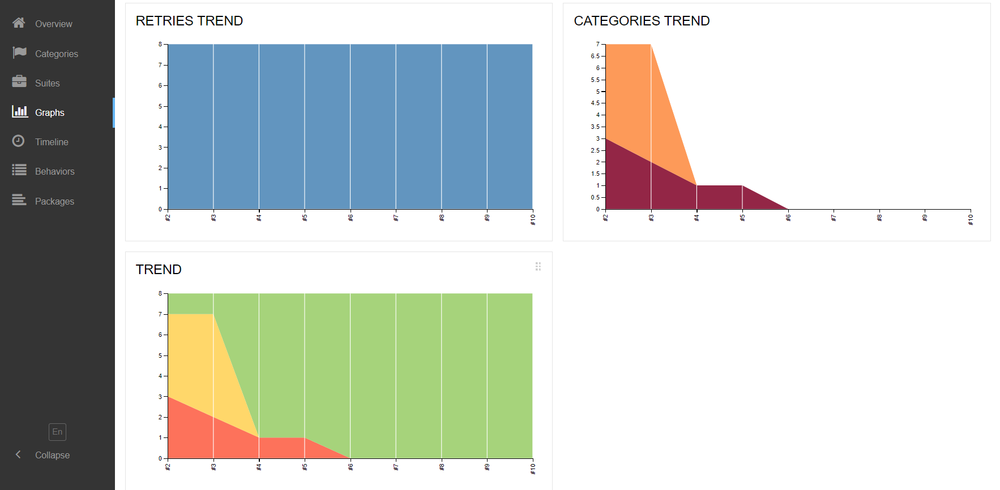
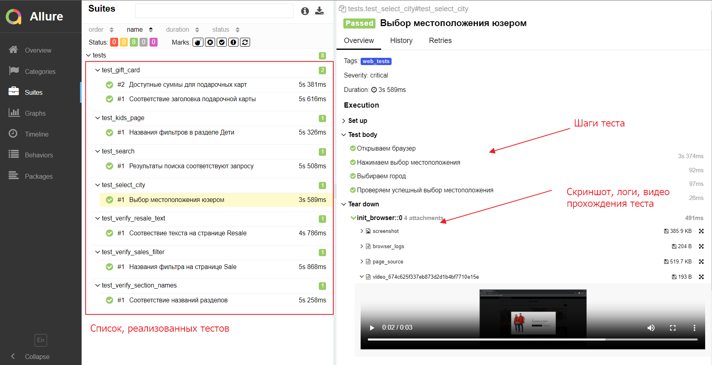
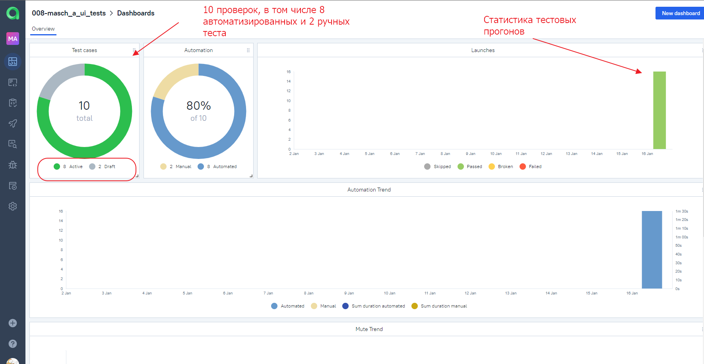
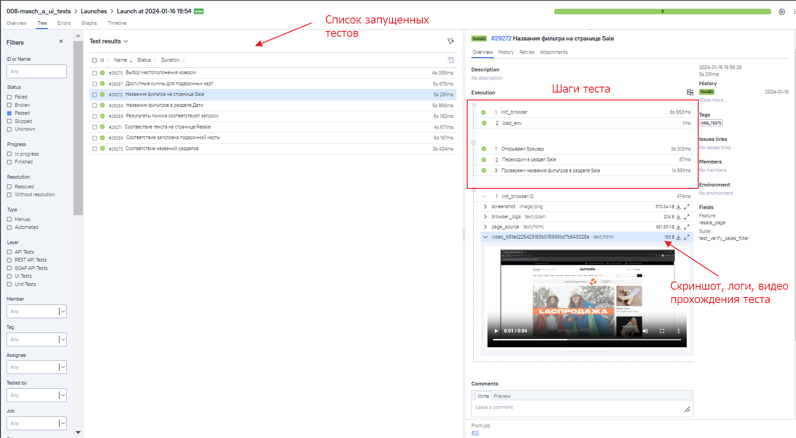
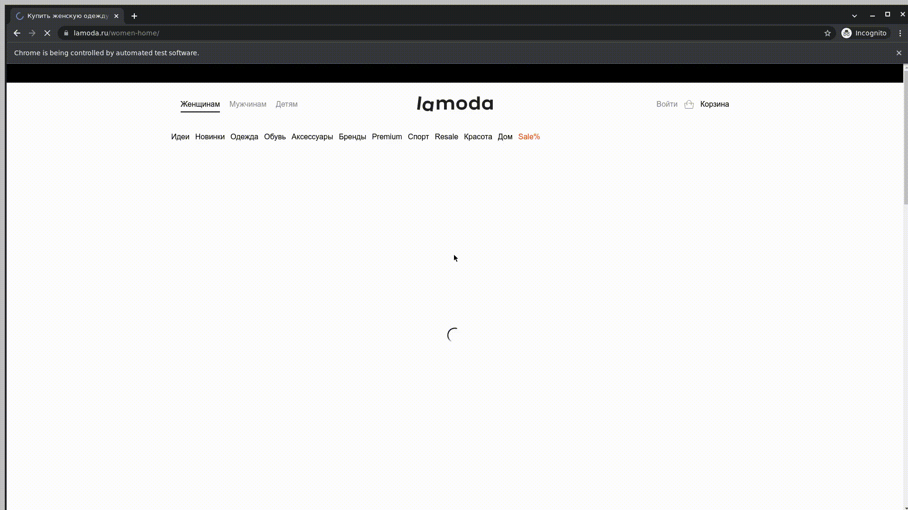

# Автоматизация тестирования сайта Lamoda


## Особенности проекта
* Оповещения о тестовых прогонах в Telegram
* Отчеты с видео, скриншотом, логами, исходной моделью разметки страницы
* Сборка проекта в Jenkins
* Отчеты Allure Report
* Интеграция с Allure TestOps
* Запуск автотестов в Selenoid

## Список, реализованных проверок
* Стоимость доступных для покупки подарочных карт 
* Корректность результатов поискового запроса
* Названия фильтров в детском разделе
* Выбор местоположения юзером
* Соотвествие текста на странице Resale
* Соответствие названий разделов
* Выдача товаров по фильтру Только со скидкой в разделе Sale

## Запуск тестов локально
```bash
python -m venv .venv
source .venv/bin/activate
pip install -r requirements.txt
pytest -s -v
```
## Запуск тестов из Jenkins
### Ссылка на проект в Jenkins
> <a target="_blank" href="https://jenkins.autotests.cloud/job/008-masch_a_ui_tests/">Jenkins</a>
> 
1. Перейти в Jenkins
2. Нажать Build with Parameters
3. Выбрать параметры запуска
4. Нажать Build
## Allure Report




## Интеграция с Allure TestOps


### Пример тестового прогона


### Видео прохождения теста


